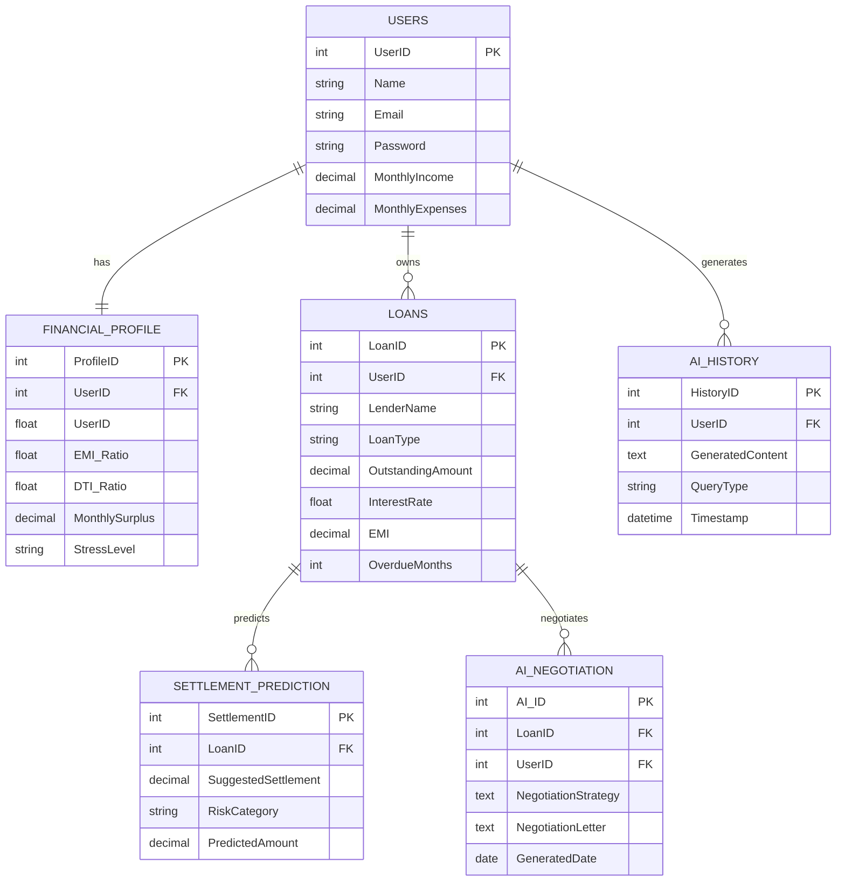

# FinRelief AI ER Diagram

```mermaid
erDiagram

    USERS {
        int UserID PK
        string Name
        string Email
        string Password
        decimal MonthlyIncome
        decimal MonthlyExpenses
    }

    FINANCIAL_PROFILE {
        int ProfileID PK
        int UserID FK
        float UserID
        float EMI_Ratio
        float DTI_Ratio
        decimal MonthlySurplus
        string StressLevel
    }

    LOANS {
        int LoanID PK
        int UserID FK
        string LenderName
        string LoanType
        decimal OutstandingAmount
        float InterestRate
        decimal EMI
        int OverdueMonths
    }

    SETTLEMENT_PREDICTION {
        int SettlementID PK
        int LoanID FK
        decimal SuggestedSettlement
        string RiskCategory
        decimal PredictedAmount
    }

    AI_NEGOTIATION {
        int AI_ID PK
        int LoanID FK
        int UserID FK
        text NegotiationStrategy
        text NegotiationLetter
        date GeneratedDate
    }

    AI_HISTORY {
        int HistoryID PK
        int UserID FK
        text GeneratedContent
        string QueryType
        datetime Timestamp
    }

    USERS ||--|| FINANCIAL_PROFILE : has

    USERS ||--o{ LOANS : owns

    USERS ||--o{ AI_HISTORY : generates

    LOANS ||--o{ SETTLEMENT_PREDICTION : predicts

    LOANS ||--o{ AI_NEGOTIATION : negotiates
```